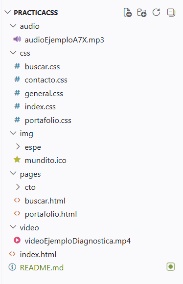
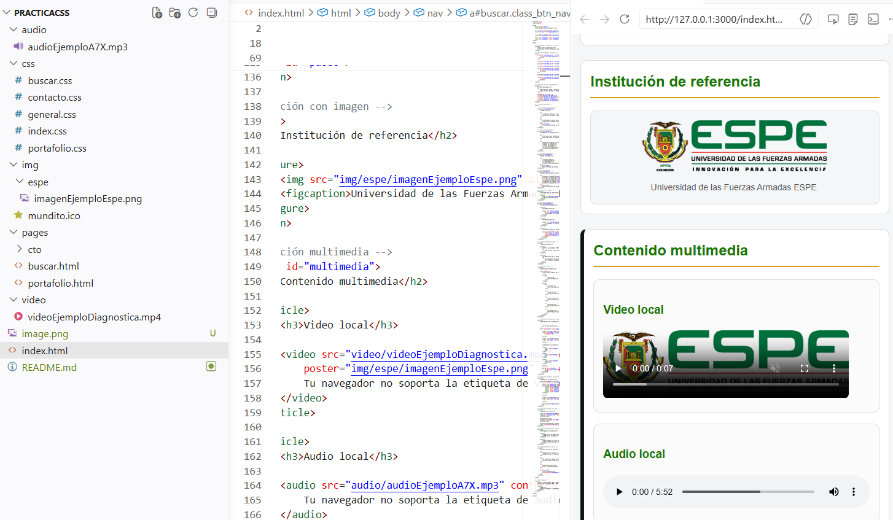

# PracticaCss

Pequeña práctica de maquetación y estilos con CSS que contiene varias páginas estáticas: página principal, búsqueda, portafolio y contacto.

## Descripción

Este proyecto contiene ejemplos de hojas de estilo separadas por página para practicar layouts, responsividad y organización de CSS. Está pensado como proyecto de estudio para aprender a estructurar estilos y recursos (imágenes, audio y vídeo) en un sitio estático.

## Estructura de carpetas

Raíz del proyecto:

- `index.html`
- `README.md`
- `audio/` — recursos de audio
- `css/`
	- `buscar.css`
	- `contacto.css`
	- `general.css`
	- `index.css`
	- `portafolio.css`
- `img/`
	- `espe/` (imágenes del proyecto)
- `pages/`
	- `buscar.html`
	- `portafolio.html`
	- `cto/`
		- `contacto.html`
- `video/`

> Nota: abrir `index.html` en un navegador para ver la página principal.

## Capturas de pantalla

Incluye aquí capturas para mostrar el resultado. Añade imágenes en la carpeta `img/` y usa rutas relativas, por ejemplo:

Si quieres, puedo insertar las capturas directamente si me indicas los nombres de archivo existentes.

## Tecnologías usadas

- HTML5
- CSS3 (organizado por archivos por página)
- Recursos estáticos: imágenes, audio y video

## Autor

- Nombre: Daniel Gustavo Barragan Montero
- Contacto: dgbarragan@espe.edu.ec

